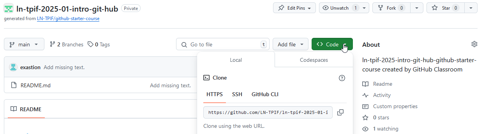

# :wave: Die Grundlagen von Git und GitHub

## 🤓 Kursüberblick und Lernziele

Ziel dieses Kurses ist es, dir eine kurze Einführung in Git und GitHub zu geben.
Wir stellen dir auch Materialien für weiteres Lernen und ein paar Ideen für den Einstieg auf unserer Plattform zur Verfügung. 🚀

## :octocat: Git und GitHub

Git ist ein **verteiltes Versionskontrollsystem (VCS)**, oder auf Englisch ein **distributed Version Control System**, was bedeutet, dass es ein nützliches Werkzeug ist, um Änderungen an deinem Code einfach zu verfolgen, zusammenzuarbeiten und zu teilen.
Mit Git kannst du die Änderungen verfolgen, die du an deinem Projekt vornimmst, sodass du immer eine Aufzeichnung deiner Arbeit hast und bei Bedarf problemlos zu einer älteren Version zurückkehren kannst.
Es erleichtert auch die Zusammenarbeit mit anderen – Gruppen von Personen können gemeinsam am selben Projekt arbeiten und ihre Änderungen in eine endgültige Quelle zusammenführen!

GitHub ist eine Möglichkeit, die gleiche Leistungsfähigkeit von Git online mit einer einfach zu bedienenden Oberfläche zu nutzen.
Es wird in der gesamten Softwarewelt und darüber hinaus verwendet, um zusammenzuarbeiten und die Historie von Projekten zu pflegen.

GitHub beherbergt einige der fortschrittlichsten Technologien der Welt.
Egal, ob du Daten visualisierst oder ein neues Spiel entwickelst, auf GitHub gibt es eine ganze Community und eine Reihe von Tools, die dich zum nächsten Schritt bringen können.
In diesem Kurs wirst du die Grundlagen von Git und GitHub kennenlernen.

## :octocat: Den GitHub-Flow verstehen

Der GitHub-Flow ist ein Workflow, der es dir ermöglicht, einfach an deinen Projekten zu experimentieren und mit anderen zusammenzuarbeiten, ohne das Risiko, deine bisherige Arbeit zu verlieren.

### Repositories

Ein Repository ist der Ort, an dem deine Projektarbeit stattfindet – betrachte es als deinen Projektordner.
Es enthält alle Dateien deines Projekts und die Revisionshistorie, also alle Versionen, die du bisher erstellt hast.
Du kannst innerhalb eines Repositories alleine arbeiten oder andere einladen, mit dir an diesen Dateien zusammenzuarbeiten.

### Klonen

Wenn ein Repository mit GitHub erstellt wird, wird es remote in der ☁️ gespeichert.
Du kannst ein solches Repository herunterladen, um eine lokale Kopie auf deinem Computer zu erstellen.
Dies wird **klonen** genannt.
Die beiden Kopien werden dann mit Git synchronisieren.
Wenn mehrere Leute an dem Projekt arbeiten, können alle das Projekt klonen und haben dann ihre eigene Kopie auf ihrem Computer.
Dies erleichtert das Beheben von Problemen, das Hinzufügen oder Entfernen von Dateien.
Du kannst auch das Bearbeitungswerkzeug deiner Wahl anstelle der GitHub-Benutzeroberfläche verwenden.
Das Klonen eines Repositories lädt auch alle Repository-Daten herunter, die GitHub zu diesem Zeitpunkt hat, einschließlich aller Versionen jeder Datei und jedes Ordners für das Projekt!
Dies kann hilfreich sein, wenn du mit deinem Projekt experimentierst und dann feststellst, dass dir eine frühere Version besser gefallen hat.
Um mehr über das Klonen zu erfahren, lies ["Cloning a Repository"](https://docs.github.com/en/github/creating-cloning-and-archiving-repositories/cloning-a-repository).

### Committing und Pushing

Wenn du den aktuellen Stand deiner Arbeit als neue Version in der Historie speichern willst, musst du deine Änderungen **committen**.
Es genügt nicht, die Datei nur zu speichern.
Jeder **Commit** stellte einen Zeitpunkt in der Entwicklung des Projektes dar.
Alle committede Änderungen können dann in das Remote-Repository auf GitHub hochgeladen werden.
Dies nennen wir Änderungen **pushen**.
Auf diese Weise können dein Lehrer und/oder deine Teamkollegen deine neueste Arbeit sehen, wenn du bereit bist, sie zu teilen.
Wenn du einen **Commit** erstellst, solltest du eine hilfreiche **Commit-Nachricht** hinzufügen, um dich selbst oder deine Teamkollegen daran zu erinnern, welche Arbeit du erledigt hast.
Ein Beispiel wäre "README mit Informationen über unser Projekt hinzugefügt", oder "Fehler im Design des Kontaktformulares behoben".

## 💻 Wichtige GitHub-Begriffe

### Repositories

Du kannst dir alle deine Repositories auf deinem ["GitHub-Dashboard"](https://docs.github.com/en/github/setting-up-and-managing-your-github-user-account/about-your-personal-dashboard) ansehen.
Stelle sicher, dass du angemeldet bist, um drauf Zugreifen zu können.

Repositories enthalten auch **README**-Dateien. 
Hierbei handelt es sich um eine Datei, die dein Projekt beschreibt.
Du bist gerade dabei, die README-Datei dieses Repositories zu lesen. 😄
Um mehr über Repositories zu erfahren, lies ["Creating, Cloning, and Archiving Repositories](https://docs.github.com/en/github/creating-cloning-and-archiving-repositories/about-repositories) und ["About README's"](https://docs.github.com/en/github/creating-cloning-and-archiving-repositories/about-readmes).

### Branches (Zweige)

Du kannst Branches auf GitHub verwenden, um Arbeiten zu isolieren, die du noch nicht in dein endgültiges Projekt zusammenführen möchtest.
Branches ermöglichen es dir, Funktionen zu entwickeln, Fehler zu beheben oder sicher mit neuen Ideen in einem abgegrenzten Bereich deines Repositories zu experimentieren.
Dies erlaubt es dir, ganz einfach an mehreren Versionen gleichzeitig zu arbeiten, ohne Kopie zu erstellen.
In der Regel erstellst du einen neuen Branch aus dem Standard-Branch deines Repositories – `main`. Dadurch wird eine neue Arbeitskopie deines Repositories erstellt, mit der du experimentieren kannst.
Sobald du mit den neuen Änderungen zufrieden bist, kannst du deine Änderungen in die Hauptversion, also den Standard-Branch deines Repositories integrieren, oder **mergen**.
Es ist auch möglich, von einem bestehenden Branch abzuzweigen.
So kann ein ganzer Baum von Branches entstehen.
Um mehr über Branching zu erfahren, lies ["About Branches"](https://docs.github.com/en/github/collaborating-with-issues-and-pull-requests/about-branches).

### Pull Requests (Pull-Anfragen)

Bei der Arbeit mit Branches kannst du eine Pull-Anfrage verwenden, um anderen über die Änderungen zu informieren, die du vornehmen möchtest, und um Feedback zu bitten.
Sobald eine Pull-Anfrage geöffnet ist, kannst du die potenziellen Änderungen mit deinen Mitarbeitern besprechen und überprüfen und bei Bedarf weitere Änderungen hinzufügen.
Wenn die Änderungen aktzeptiert werden, können diese gemerged werden.
Um mehr über Pull-Anfragen zu erfahren, lies ["About Pull Requests"](https://docs.github.com/en/github/collaborating-with-issues-and-pull-requests/about-pull-requests).

### Issues (Probleme)

Issues sind eine Möglichkeit, Verbesserungen, Aufgaben oder Fehler für deine Arbeit auf GitHub zu verfolgen.
Issues sind eine großartige Möglichkeit, alle Aufgaben zu verfolgen, an denen du für dein Projekt arbeiten möchtest, und andere wissen zu lassen, woran du zu arbeiten planst.
Du kannst Issues auch verwenden, um ein Open-Source-Projekt über einen Fehler zu informieren, den du gefunden hast, oder über eine Funktion, die deiner Meinung nach eine großartige Ergänzung wäre!

Du kannst auch Pull-Anfragen und Issues miteinander verknüpfen, um zu zeigen, dass eine Korrektur in Arbeit ist, und das Issue automatisch zu schließen, wenn jemand die Pull-Anfrage mergt.
Um mehr über Issues und deren Verknüpfung mit deinen Pull-Anfragen zu erfahren, lies ["About Issues"](https://docs.github.com/en/github/managing-your-work-on-github/about-issues).

### Markdown auf GitHub verwenden

Du hast es vielleicht schon bemerkt, aber du kannst deinen Issues, Pull-Requests und Dateien ein paar lustige Formatierungen hinzufügen.
["Markdown"](https://guides.github.com/features/mastering-markdown/) ist eine einfache Möglichkeit, deine Issues, Pull-Requests und Dateien mit einer einfachen Syntax zu gestalten.
Dies kann hilfreich sein, um deine Informationen zu organisieren und sie für andere leichter lesbar zu machen.
Du kannst auch GIFs und Bilder einfügen, um deine Aussagen zu verdeutlichen!
Um mehr über die Verwendung der GitHub-eigenen Markdown-Variante zu erfahren, lies ["Basic Writing and Formatting Syntax"](https://docs.github.com/en/github/writing-on-github/basic-writing-and-formatting-syntax).

## 

Git kannst du sowohl für Windows, Linux und MacOS herunterladen und installieren.
Es handelt sich um ein Kommandozeilenprogramm, wird also über eine Kommandozeile benutzt und besitzt keine graphische Oberfläche.

Git kann auf folgender Seite heruntergeladen werden: ["Git Downloads"](https://git-scm.com/downloads)

### Die 2,3 Zustände einer Datei

Eine Datei kann Git bekannt sein, oder nicht.
Wir reden von **tracked** und **untracked**.
Zu beginn sind alle Dateien immer untracked und sie werden tracked, wenn sie zu Git hinzugefügt werden.
Git kann nur Versionen von Dateien erstellen, die getracked werden.

Für Git kann eine Datei in 3 verschiedenen Zuständen sein:
 * **Unmodified**
 * **Modified**
 * **Staged**

Wenn eine Datei unmodified ist, wurde sie seit der letzten Version nicht verändert.
Eine Datei, die modified ist, wurde seit der letzten Version verändert.
Hierbei handelt es sich meistens um die Dateien, an den gerade gearbeitet wird.
Wenn eine Datei staged ist, bedeutet dies, dass sie bereit ist, in die nächste Version aufgenommen zu werden.


### Befehle

Alle Befehle, die du mit Git benutzts beginnen mit `git`!

#### Einrichten

Nach der Installation von Git, muss dieses Eingerichtet werden.
Hierfür musst du deinen Namen und deine Email-Adresse angeben, damit später klar ist, wer welche Datei verändert hat.
Dies wird mit dem `git config` Befehl gemacht.

```bash
git config --global user.name "<Dein Name>"
git config --global user.email <Deine Email-Adresse>
```

#### Hilfe holen

Git bietet für jeden Befehl Hilfe an.
Dies geht mit
```bash
git help <cmd>
̀ ``
oder
```bash
git <cmd> -h
```

#### Klonen

Um ein Repository auf deinen Rechner zu Klonen, benutzt du den Befehl `git clone` gefolgt von der URL des Remote-Repositories und dem Ordner, in den die Dateien heruntergeladen werden sollen.
Wenn du keinen Ordner angibst, wird ein neuer Ordner mit dem Namen des Repositories erstellt.

```bash
git clone <Remote-URL> [<Local-Repository>]
```

Diesen Befehl führst du in der Regel nur einmal pro Rechner und pro Repository aus!

Mit dem Befehl `cd <repository>` kannst du nun in dein Repository wechseln.

Dein Repository wird standardmäßig nach `C:\Users\<Benutzername>` geklont.

Wenn du einen anderen Ordner benutzen willst, kannst du in diesem Ordner Git Bash über einen Rechtsklick öffnen.

Die URL findest du auf der Startseite des Repositories auf GitHub:



Der Befehl zeigt dir an, wo die Dateien heruntergeladen werden und um wieviele Dateien es sich handelt:


#### Status

Um während der Arbeit zu sehen, welche Dateien gerade bearbeitet werden, auf welchem Branch man sich befindet, was die Unterschiede zum Remote-Repository sind, ... kann man den Befehl `git status` benutzen.
Dieser Befehl ist sehr vielseitig.
In seiner einfachsten Form zeigt er nur einige Informationen zum aktuellen Stand des Repositories.
Erfahre mehr über diesen Befehl in der [status-Referenz](https://git-scm.com/docs/git-status).

#### Dateien tracken

Dateien können mit dem Befehl `git add <file>` zu Git hinzugefügt werden.
Sie sind ab dann getracked.

#### Neue Version erstellen

Wenn eine neue Version erstellt werden soll, müssen alle Dateien committed werden.
Dies geschieht mit dem Befehl `git commit`.
Nun öffnet sich ein Texteditor, in welchem die Commit-Mitteilung geschrieben werden kann.
Wird diese Datei erfolgreich gespeichert, ist die neue Version erstellt.

**Achtung**: Es werden nur die Dateien committed, welche sich in der staging-Arena befinden.
Also nur die Dateien, welche mit `git add` für den nächsten Commit gekennzeichnet wurden.
Willst du alle Dateien committen, die seit der letzten Version geändert wurden, kannst du folgenden Befehl nutzen:
```bash
git commit -a
```

Es ist auch möglich, diese Mitteilung direkt in den Befehl zu schreiben.
Dies ist sinnvoll, wenn es sich nur um eine Zeile handelt.
In diesem Fall sieht der Befehl folgendermaßen aus:
```bash
git commit -m <message>
```

Du kannst `-a` und `-m` auch miteinander kombinieren.

#### Synchronisation

Mit dem Befehl `git pull` kannst du alle Änderungen, die sich auf dem Server befinden "herunterziehen".
Sollten Änderungen vorhanden sein, die mit deinen Änderungen in Konflikt stehen, wirst du dazu aufgefordert, diese Konflikte zu lösen.

Mit dem Befehl `git push` kannst du deine Änderungen auf den Server "hinaufschieben".
Dies ist nur erfolgreich, wenn sich keine Änderungen von anderen auf dem Server befinden.
Um sicherzugehen, dass dies nicht der Fall ist, muss immer zuerst "gepullt" werden und dann erst "gepusht".

Da du, zumindest anfangs, der einzige bist, der in deinem Repository arbeitet, sollte es nicht zu Konflikten kommen, es sei denn du arbeitest von mehreren Orten gleichzeitig, was natürlich auch volkommen OK ist.

## 📖 Die Entstehung von Git
Wieso brauchen wir überhaubt ein verteiltes VCS wie Git?
Zugriff auf ältere Versionen von Dateien zu haben kann in vielen Fällen nützlich sein.
Dies kann zum Beispiel nach einem Datenverlust der Fall sein, oder wenn man mit Änderungen, die man an einer Datei gemacht hat nicht mehr zufrieden ist.
Die einfachste Variante der Versionierung ist das Kopieren der Dateien in einen neuen Ordner, wenn eine neue Version erstellt werden soll.
Dies ist allerdings Fehleranfällig, da es ganz einfach ist, eine alter Version zu überschreiben.

### 🏠 Lokale VCS
Bei einem lokalen VCS handelt es sich um eine Datenbank, die sich auf einem Computer befindet.
Deren Aufgabe ist es, die verschiedenen Versionen der versionierten Dateien zu verwalten.
Da die Versionierung jetzt von einer Software übernommen wird, besteht die Gefahr des Überschreibens nicht mehr.

### Centralized VCS
Wenn mehrere Leute an einem Projekt arbeiten, wird auch beim lokalen VCS noch eine Möglichkeit gebraucht, die verschiedenen Versionen miteinander zu teilen.
Dies erfordert wiederum das Kopieren von Dateien, was auch wieder zu Fehlern führen kann.
Hier schaffen Zentralisierte VCS Abhilfe.
Es handelt sich um VCS, welche sich auf einem zentralen Server befinden.
Wenn ein Benutzer jetzt eine Datei verändern will, muss er sie von diesem Server herunterladen.
Die Änderungen müssen dann wieder hochgeladen werden.
Diese zentrale Datenbank wird von einem Administrator verwaltet.

Wie immer bei einem zentralen System, besteht hier ein großes Problem: Single-Point-of-Failure.
Wenn es ein Problem mit diesem Server gibt, kann niemand mehr an dem Projekt arbeiten.


### Decentralized VCS
Die dezentralen VCS lösen dieses Problem.
Es besitzt jetzt nicht mehr nur ein zentraler Server die gesamte Datenbank, sondern jeder Computer, auf dem dieses Projekt bearbeitet wird, erhällt eine Kopie der gesamten Datenbank.
Dies ermöglicht es auch dann noch zu arbeiten, wenn der Server nicht erreichbar ist.
Auch können die Computer als Backup angesehen werden, von denen jederzeit Daten wiederhergestellt werden können.


### Git
Git wurde für die Entwicklung des Linux Betriebsystems geschrieben.
In den Jahren 1991 bis 2001 fand diese nämlich über Patches und Archive statt, welche von den Entwicklern ausgetauscht wurden.
Im Jahr 2002 wurde dann ein proprietäres DVCS benutzt.
Allerdings gab es im Jahr 2005 Streit mit dieser Firma, wodurch ein neues System her musste.

Git wurde mit einigen notwendigen Eigenschaften erschaffen:
 * Geschwindigkeit
 * Einfachheit
 * Nicht-lineare Entwicklung
 * Komplett Verteilt
 * Fähig sehr große Projekte zu unterstützen

## Wie funktioniert Git?
Worin Git sich von anderen DVCS unterscheidet, ist die Art der Versionierung.
Die meisten anderen speichern nur die Änderungen der Dateien.
Git erstellt hingegen für jede neue Version eine Kopie der veränderten Dateien.

Alles ist lokal.
Somit kann auch gearbeitet werden, wenn keine Internetverbindung besteht.

In Git wird alles gehashed.
Es wird also eine Art Quersumme aller Dateien berechnet, die sich in einer Version befinden.
Diese dient der Identifikation der Version.
Hierfür wird der SHA1-Algorithmus angewandt, welcher einen 40 Zeichen langen Hexadezimalen Wert ausgibt.
Da sich dieser ändert, sobald sich auch nur eine Kleinigkeit an den Dateien verändert, weiß Git, wann sich Dateien geändert haben.

Mit Git wird immer nur hinzugefügt.
Im normalen Gebrauch, wird Git nie etwas vergessen.

## 🗒️ Aufgaben
1. Lade *Git für Windows* auf deinem Laptop herunter und installiere es.
   Benutze bei der Installation die Standardwerte außer für den **Standardeditor** und den Hauptbranch.
   Benutze hier **Notepad** und **main**.
2. Erstelle einen Screeshot von diesem Schritt und speichere diesen als Datei!
   Starte **Git BASH** und initialisiere Git.
   Wenn du nicht mehr weißt wie dies geht, kannst du im Abschnitt [Einrichten](#Einrichten) nachschauen.
   Benutze als Emailadresse deine `@school.lu` Adresse.
4. Erstelle ein Konto auf [GitHub](https://github.com) mit einem Benutzernamen deiner Wahl und deiner Schuladresse.
5. Öffne dieses Assignment. Den Link bekommst du von deinem Lehrer.
6. Wähle deinen Namen aus.
7. Akzeptiere das Assignment.
8. Erstelle einen Ordner auf deinem Laptop, für alle Aufgaben dieses Semesters.
9. Klone dein Repository für dieses Assignment in dieses Ordner. **Achtung:** Du kannst kein <kbd>Ctrl</kbd>+<kbd>V</kbd> in Git BASH nutzen! Einfügen kannst du mit <kbd>⇧ Shift</kbd> + <kbd>Ins</kbd> oder rechtem Mausklick. Solltest du trotzdem <kbd>Ctrl</kbd>+<kbd>V</kbd> drücken, führt dies meist zu einem Fehler.
10. Erstelle nun die Datei `Aufgabe.md` und committe diese mit der Nachricht "My first commit".
11. Pushe diese Änderungen auf den Server. Hinter der Commit-Nachricht befindet sich ein rotes Kreuz. Dies bedeutet, dass noch nicht alles richtig ist. Die Aufgabe ist aber noch nicht fertig.
12. Klicke auf das rote Kreuz und dann auf "Details", um dir die Details zu den Tests anzusehen. Wenn du bis jetzt alles richtig gemacht hast, hast du einen von zwei Tests bestanden.
13. Füge den Screenshot den du vorhin erstellt hast zu deinem Repository hinzu und nenne es "Init.png" oder "Init.jpg".
14. Committe das Bild mit der Nachricht "Add screenshot".
15. Füge in der vorhin erstellten Datei eine Überschrift "Aufgabe" hinzu.
16. Füge das Bild unter der Überschrift ein.
17. Committe mit der Nachricht "Add image to file" und pushe deine Änderungen.
18. Schaue dir die Tests an und überprüfe, dass du jetzt alle bestehst. In diesem Fall ist ein grüner Haken neben deiner Commit-Nachricht.
19. Wenn alles erledigt ist, erstelle einen neuen Pull-Request. Mit diesem kannst du deinem Lehrer mitteilen, dass du mit der Aufgabe fertig bist und ein Kommentar hinterlassen.


## 📝 Nächste Schritte

* Erstelle eine neue Markdown-Datei "Notizen.md" in diesem Repository. Schreibe in diesem auf, was du gelern hast, damit du später schnell darauf zugreifen kannst. Du kannst auch Screenshots einfügen.
* Erstelle deine Profil-README. Lass die Welt ein wenig mehr über dich wissen! Woran bist du interessiert? Woran arbeitest du? Was ist dein Lieblingshobby? Erfahre mehr über das Erstellen deiner Profil-README im Dokument ["Managing Your Profile README"](https://docs.github.com/en/github/setting-up-and-managing-your-github-profile/managing-your-profile-readme).


## 📚 Ressourcen

* [Das Git Buch](https://git-scm.com/book/en/v2) (Dieser Kurs basiert darauf)
* [Ein kurzes Video, das erklärt, was GitHub ist](https://www.youtube.com/watch?v=w3jLJU7DT5E&feature=youtu.be)
* [Lernmaterialien zu Git und GitHub](https://docs.github.com/en/github/getting-started-with-github/git-and-github-learning-resources)
* [Das GitHub-Flow verstehen](https://guides.github.com/introduction/flow/)
* [So verwendest du GitHub-Branches](https://www.youtube.com/watch?v=H5GJfcp3p4Q&feature=youtu.be)
* [Interaktive Git-Schulungsmaterialien](https://githubtraining.github.io/training-manual/#/01_getting_ready_for_class)
* [GitHub's Learning Lab](https://lab.github.com/)
* [Forum der Education-Community](https://education.github.community/)
* [GitHub-Community-Forum](https://github.community/)
